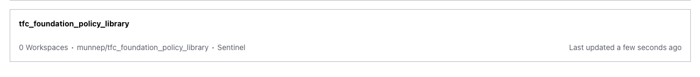

# tfc_foundation_policy_library

HashiCorp has moved the Foundation Policy Library to the Public Registry called `Policies Library`. This can be found [here](https://registry.terraform.io/browse/policies)

This repo shows an example on how to use a policy from the `Policies Library`. This case we will use a policy that verifies the creation of a security rule on AWS that allows traffic from `0.0.0.0/0` to port 22. 

# Prerequesites
- Have access to Terraform Cloud
- Have access to AWS


# How to
- Fork this repo to your own environment
- We are going to use a policy that was gathered from the Terraform Registry policies [here](https://registry.terraform.io/policies/hashicorp/aws-networking-terraform/1.0.2/policy/deny-public-ssh-acl-rules)  

  

- Look at the contents of the file `sentinel.hcl`
```hcl
policy "deny-public-ssh-acl-rules" {
  source = "https://registry.terraform.io/v2/policies/hashicorp/aws-networking-terraform/1.0.2/policy/deny-public-ssh-acl-rules.sentinel?checksum=sha256:b56a7869c9ddd2bece7de8d251de106e072407207247e6f94e001b6eba22c71b"
  enforcement_level = "advisory"
}
```
- Login to your TFC account
- Go to settings -> Policy Sets
  
- Connect a new policy set  
  
- Connect to your repository  

- Select the repository  you forked  
  
- Leave the name as it is and select `policies enforced on selected workspaces`  Don't select a workspace yet
  
- You should now have the policy in you overview  

- Add a workspace that will make use of this policy set
- Add a new workspace
  
- Version control  

- Select your github environment  
  
- select the same repo again you forked (we will run terraform from a diffirent directory)
  
- Create the workspace   
  
- On the workspace you just created go to Settings -> General -> Terraform Working Directory and add the value `terraform_code`  


- On the `variables` page add your AWS credentials 
  

- Go back to the policy sets and select the policy we created
- Add the workspace to the policy set (click on the add button)  

- The overview should show there is now 1 workspace on this policy set  

- Go back to the workspace and do a terraform plan  
   
- The sentinel policy will run and see that the codes wants to create a security rule which is not allowed accoording to your policy    


